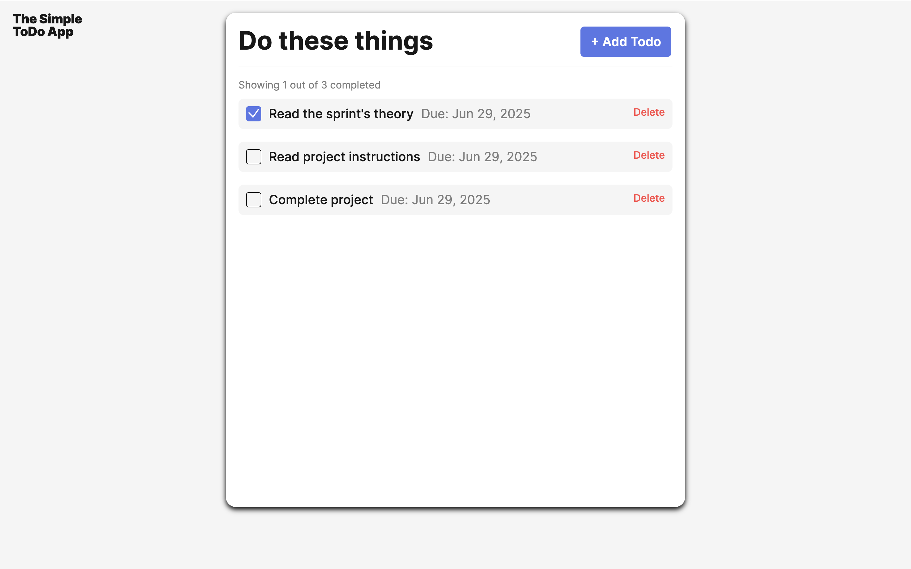
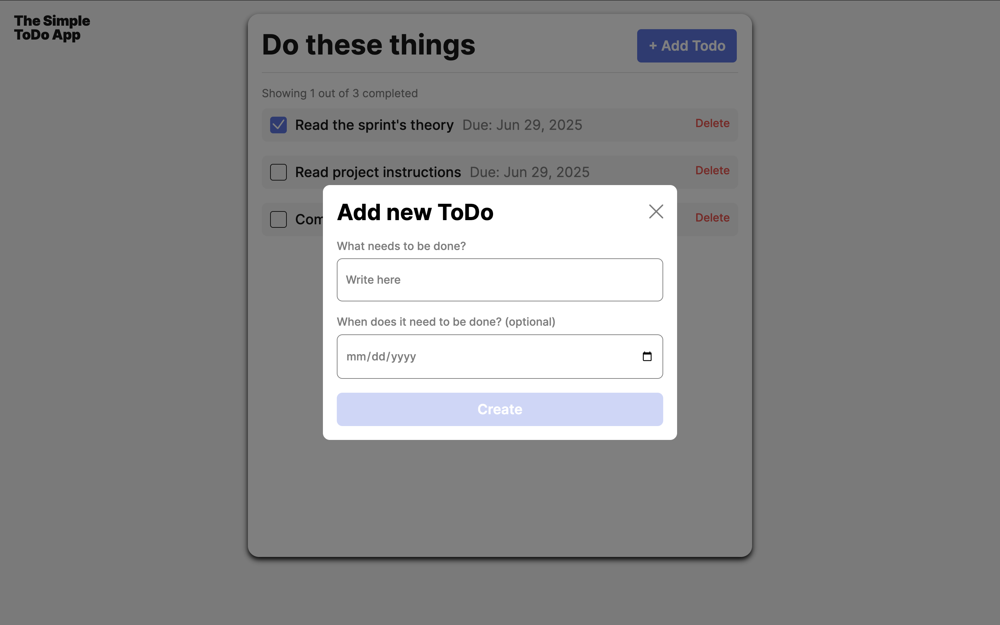
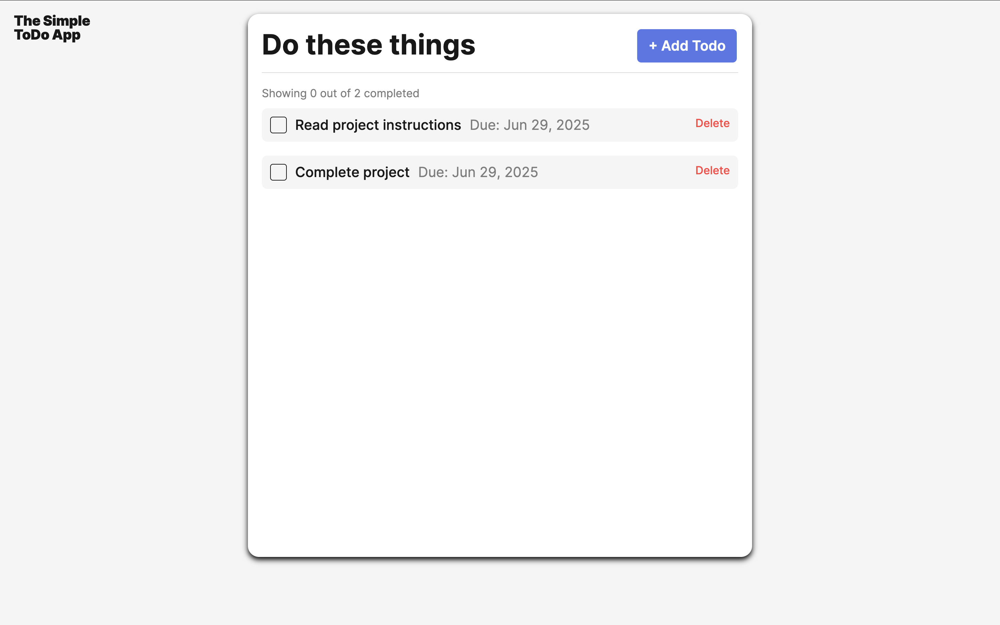

# Simple To-Do App

This project is the 7th and 8th in the Software Engineering program at TripleTen. It showcases the use of front-end web development skills to build a simple to-do app.

## Table of Contents

- [Project Description](#project-description)
- [Project Features](#project-features)
- [Plan on Improving the Project](#plan-for-improving-the-project)
- [Screenshots](#screenshots)
- [Live Demo](#live-demo)
- [Deployment Instructions](#deployment-instructions)
- [System Requirements](#system-requirements)

## Project Description

This app was created using HTML, CSS, and JavaScript, with some previous code refactored for improvement. The main functionalities of this to-do app allow users to:

- Add tasks to the to-do list
- Set reminders for tasks
- Manage a list of tasks with optional to-do dates
- Delete tasks

The goal is to help users manage their daily tasks effectively with this interactive and simple to do app.

## Project Features

- HTML: for content structure
- CSS: for styling and layout
- JavaScript: for interactivity and task management
- Object-oriented programming (OOP) - with ES6 classes
- Form validation
- Event handling
- BEM methodology for CSS
- Responsive Design: user friendly for different devices

## Plan for improving the project

- Add more functionality by implementing a success message or background animation for when a user completes a task, giving them a sense of accomplishment and encourages them to engage with finishing another task
- Create a popup for modifying or adding notes to a specific task
- Introduce the option for adding certain tasks to be recurring

## Screenshots

## Main Page



## Add Task



## Delete Task



## Live Demo 

This project is live and can be accessed on GitHub Pages:

- https://samjamhas10.github.io/se_project_todo-app/


## Deployment Instructions

To run the project locally:

1. Clone the repository:

   ```bash
   git clone https://github.com/samjamhas10/se_project_todo-app.git
   ```

2. Navigate to project directory:

   cd se_project_todo-app

3. Open the index.html file in your browser

## System Requirements

Modern web browsers:

- Chrome
- Firefox
- Safari

No additional installtions needed.